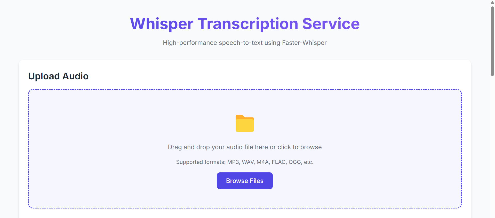

# Whisper FastAPI Transcription Service

A high-performance, production-ready speech-to-text API service based on the faster-whisper library.

## Features

- Efficient transcription using the CTranslate2-based faster-whisper implementation
- Support for all Whisper models (tiny, base, small, medium, large-v2, large-v3, distil)
- REST API with comprehensive endpoints
- Background task processing
- Word-level timestamps
- Voice Activity Detection (VAD) for filtering silence
- Batched inference for faster processing
- Docker and Docker Compose support for easy deployment
- CUDA support for GPU acceleration

## Getting Started

### Prerequisites

- Docker and Docker Compose (recommended)
- NVIDIA GPU with CUDA support (optional but recommended for performance)
- Python 3.8+ (if not using Docker)

### Running with Docker

1. Clone this repository:
   ```bash
   git clone https://github.com/iammuhammadnoumankhan/Whisper-FastAPI-Transcription-Service.git
   cd Whisper-FastAPI-Transcription-Service
   ```

2. Start the service:
   ```bash
   docker-compose up -d
   ```

3. The service will be available at `http://localhost:8000`.

### Running Locally

1. Install dependencies:
   ```bash
   pip install -r requirements.txt
   ```
   or
   ```bash
   pip install fastapi uvicorn python-multipart faster-whisper pydantic
   ```

2. Start the service:
   ```bash
   uvicorn app:app --host 0.0.0.0 --port 8000 --reload
   ```

## UI Access
After starting the API, you can access the UI at:
```bash
http://localhost:8000/static/index.html
```
This provides a user-friendly interface for transcription.



## API Endpoints

### Transcribe Audio

```
POST /api/transcribe
```

Upload an audio file for transcription. Returns a task ID that can be used to check the status.

#### Request

- Content-Type: multipart/form-data
- Body:
  - file: Audio file (mp3, wav, etc.)
  - options (optional): JSON string with transcription options

#### Example transcription options:

```json
{
  "model_size": "large-v3",
  "device": "cpu",
  "compute_type": "int8",
  "language": "ja",
  "batch_size": 16,
  "beam_size": 5,
  "word_timestamps": true,
  "vad_filter": true,
  "vad_parameters": {
    "min_silence_duration_ms": 500
  },
  "condition_on_previous_text": true,
  "use_batched_mode": true
}
```

### Get Task Status

```
GET /api/tasks/{task_id}
```

Check the status of a transcription task.

### List Tasks

```
GET /api/tasks?limit=10&status=completed
```

List transcription tasks with optional filtering.

### Delete Task

```
DELETE /api/tasks/{task_id}
```

Delete a transcription task and its associated data.

### Health Check

```
GET /api/health
```

Check if the service is running properly.

## Client Usage

A client script is provided for testing the API:

```bash
python client.py http://localhost:8000 path/to/audio.mp3 output.txt
```

## Configuration

The service can be configured using environment variables:

- `PORT`: Port to run the service on (default: 8000)
- `HOST`: Host to bind to (default: 0.0.0.0)
- `MODEL_DIR`: Directory to store downloaded models (default: None)

## Performance Optimization

For best performance:

1. Use GPU acceleration with CUDA
2. Use the batched mode for faster processing
3. Choose the appropriate model size for your needs:
   - `tiny`, `base`, `small`: Lower quality but faster
   - `medium`: Good balance between quality and speed
   - `large-v3`: Highest quality but slower
   - `distil-large-v3`: Comparable to large with faster processing time

## License

[MIT License](LICENSE)